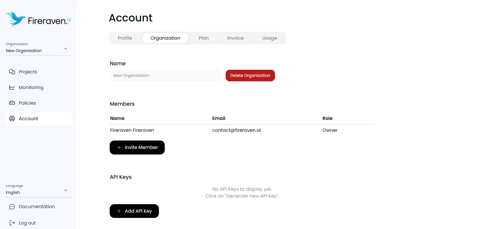
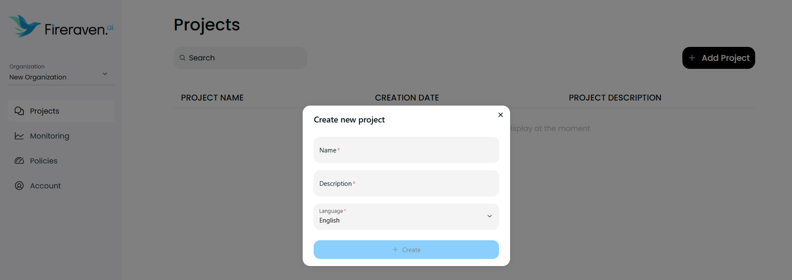
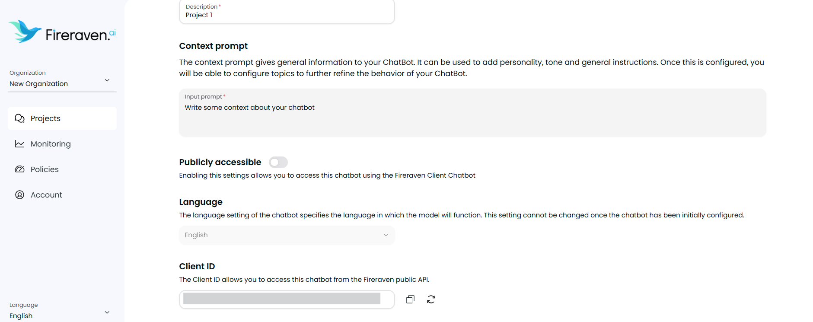
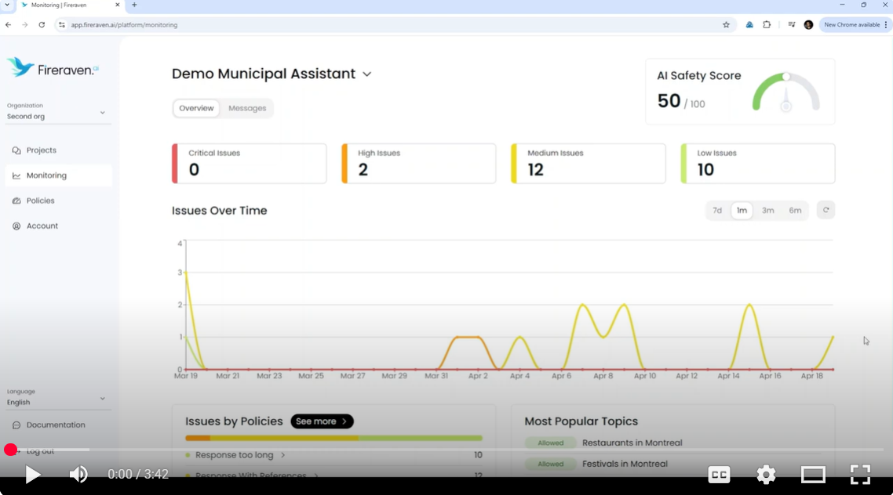

# fireguard-demo-python

Simple Demo of FireGuard integrated with an OpenAI assistant (Python) through a command-line interface.

## Features

- **Simple Chat Interface**: Easy-to-use command-line chat with OpenAI
- **FireGuard Integration**: Connected to FireGuard input and output guardrails
- **Conversation History**: Maintains message history throughout the session


## Installation

1. **Clone or download this repository**

2. **Create and activate a virtual environment**
    ```bash
   pip install virtualenv
   virtualenv env
   env/Scripts/activate
   ```

3. **Install dependencies**:
   ```bash
   pip install -r requirements.txt
   ```

4. **Create an account on Fireraven and get your API Key and Client ID**
- Go to https://app.fireraven.ai/ and create an account
- Go to `Account` > `Organization` and click on `Add API Key`

- Save the API Key
- Go to `Projects` and click on `Add Project`

- Go to your project and in the tab `General` scroll at the bottom to find your `Client ID` (which is the ID of your project)

- Save the Client ID


5. **Set up your API keys**:
   
   Create a `.env` file in the project directory:
   ```bash
   # OpenAI API Key (required)
   OPENAI_API_KEY=your_openai_api_key_here
   
   # FireGuard API Configuration
   FIRERAVEN_CHATBOT_CLIENT_ID=your_client_id
   FIRERAVEN_GUARDRAILS_API_KEY=your_fireraven_api_key
   ```

6. **Configure your FireGuard input and output guardrails**
- You can configure the input guardrail from `Projects` > `Topics` and configure some safe and unsafe topics and questions
- You can configure the output guardrail from `Policies`, add new custom policies and then link them to your project in `Projects` > `Guardrails`
- More information is available in the video here: 
[](https://www.youtube.com/watch?v=iqAqdHvMxmQ "Fireraven AI Security Suite Demo")

## Usage

Run the main script:
```bash
python main.py
```

### How to Use

Once the application is running, simply type your message and press Enter to chat with the AI. The conversation history is maintained throughout the session.

To exit the program, type `quit`, `exit`, or `bye`.

## Project Structure

- `main.py` - Main application file with simplified command-line interface
- `openai_client.py` - OpenAI API client with message history management, and FireGuard Input/Output Guardrails integrated
- `fireguard_create_conversation.py` - FireGuard conversation creation utility
- `fireguard_input_guardrail.py` - FireGuard Input Guardrail integration
- `fireguard_output_guardrail.py` - FireGuard Output Guardrail integration
- `requirements.txt` - Python dependencies
- `.env` - Your API key configuration (create this file with your API keys)

## Requirements

- Python 3.7+
- OpenAI API key
- Fireraven API key
- Fireraven Client ID

## Dependencies

- `openai>=1.0.0` - Official OpenAI Python library
- `python-dotenv>=1.0.0` - For loading environment variables from .env files

